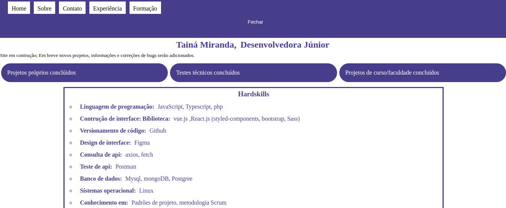

## Este é o meu portifólio online e eu desenvolvi com react e utilizei as seguintes recursos desta tecnologias.
 
### react routes - Para poder ter navegação entre as páginas.
### componentes - Para reaproveitar códigos.
### emailjs - Para receber dados do formulário de contato

 
Este é o link de acesso do meu portifólio.
 
<a href="https://portifolio-tainamiranda2.vercel.app">Link do projeto online</a>
